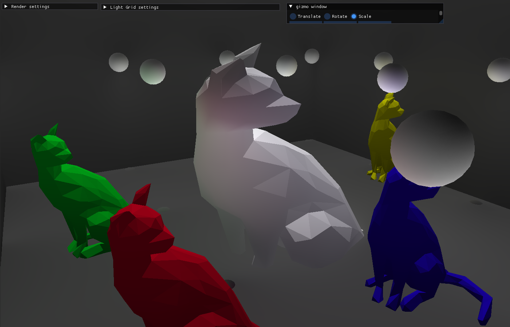
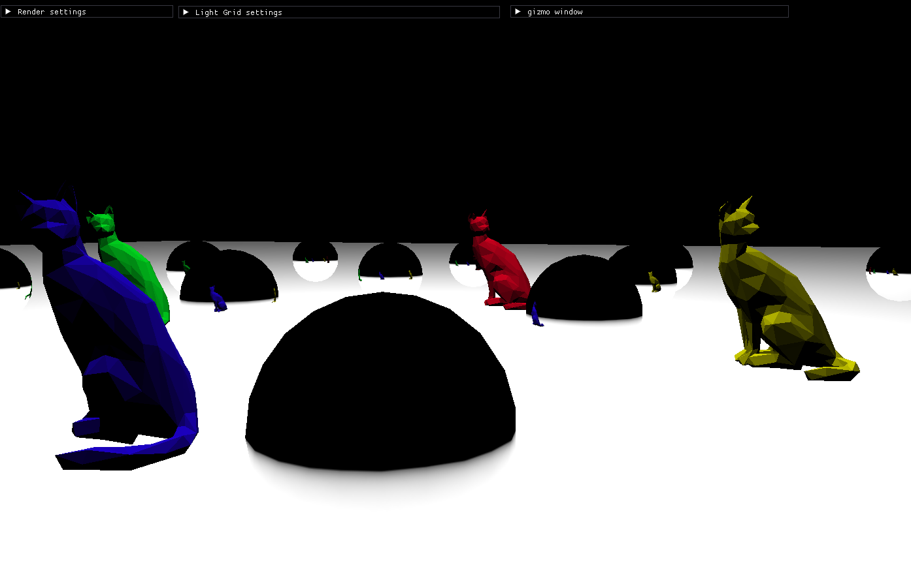
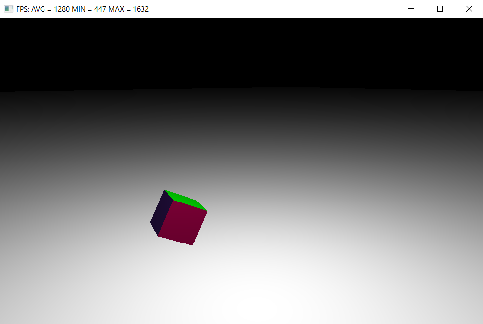
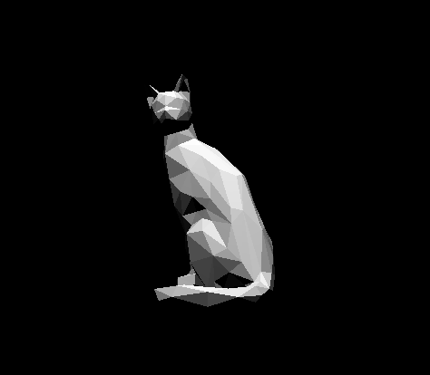
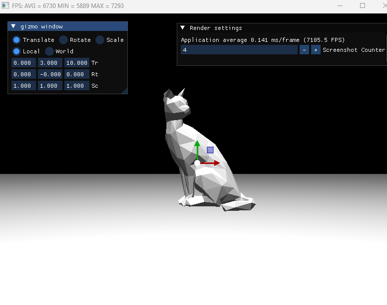

# Dependencies
- DirectX12 and Graphics Tool Component (installed by default in windows 10+) 
- MSVC (Visual Studio 2022, other compilers have not been tested)

# Building
Update submodules:
```
git submodule update --init --recursive
```

Building using cmake:
```
cmake -B build
cmake --build build
```
Or cmake extension for vs code
## Irradiance volume 11_01_25


## Light probs (env) 28_12_24


## Added controlled camera 20_07_24


## Added assimp library


## 01_09_24

